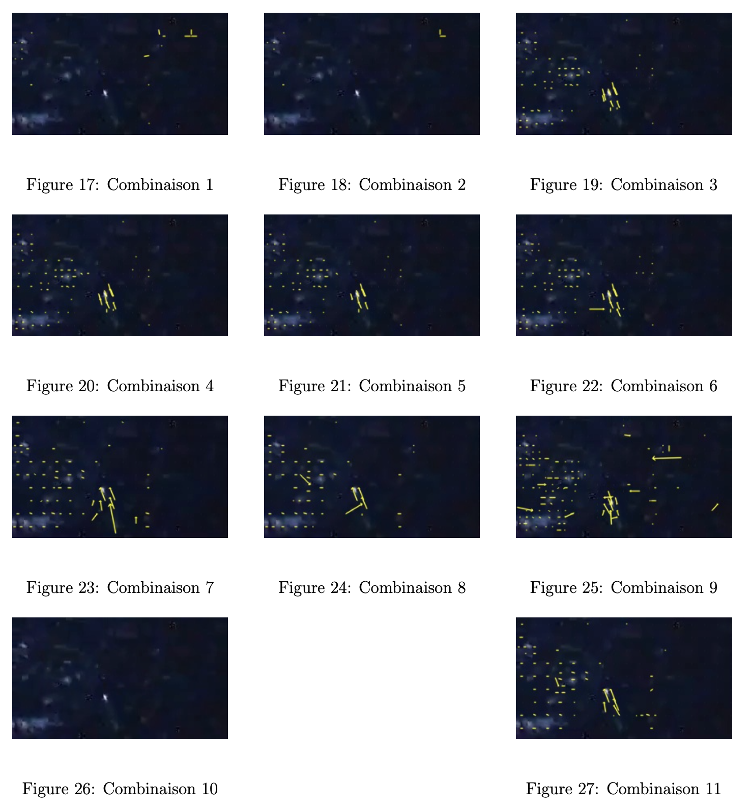

# Définition utiles

### Canaux

Les **canaux** sont des matrices possédant l’information modifiée des pixels de l’image dont on calcule le flux optique. Nous pouvons les définir comme des caractéristiques globales et grossières ou étant simplement une sortie d’une couche de convolution. Ils sont aussi appelés **patch**.

Un **canal** (ou "feature map") est classiquement une des trois images élémentaires qui composent une image couleur (canal rouge, canal vert, canal bleu). Néanmoins, en traitement d’images (et notamment dans notre cas), il est possible d’étendre la définition de canal. Un canal est alors une couche de l’image apportant des informations sur celle-ci (donc pas nécessairement la couleur). Par exemple, un canal peut représenter les contours de l’image, un autre peut représenter les zones lumineuses de l’image… En général, un canal représente une caractéristique de l’image.

  

### Coarse feature

Une **coarse feature** est un canal à l’intérieur du réseau qui contient les informations de l’image de manière "grossière" (coarse en anglais) avant le produit rendu par le réseau.

### Unpooling

L’**unpooling** après le pooling consiste à augmenter la taille des canaux pour retrouver une image avec une bonne résolution.

### Upconvolution

L’**upconvolution** est une sorte d’unpooling qui consiste à faire un **upsampling** puis une convolution.

### Bed of nails

Le **bed of nails** est une méthode d’unpooling qui garde la donnée en haut à gauche et place des zéros autour.

### Frame pairs

Les **frame pairs** sont la paire d’images où on cherche à établir le flux optique.

### Ground truth

Les données **ground truth** représentent dans notre cas le flux optique réel.

### Ground truth density per frame

Le **ground truth density per frame**, en français le pourcentage de données réelles par image, permet de donner le pourcentage de l’image où on a le flux optique réel (si c’est à 50 %, la moitié de l’image n’a pas de données réelles).

### Stride of 2

La méthode de **stride of 2** est une couche de convolution où le masque, au lieu de se déplacer de "+1" position, se déplace de "+2" positions, ce qui diminue la taille de moitié.

### ReLU

Le **ReLU** est une fonction d’activation qui met à 0 des données dépassant un certain seuil (dans notre cas, qui sont négatives).

### End-to-end Point Error (EPE)

L’**End-to-end Point Error** est l’erreur standard pour l’estimation du flux optique, où le flux optique estimé (pour un pixel donné : \( v_{est} \)) est comparé avec les données GT (ground truth) (pour un pixel donné : \( v_{gt} \)) et est calculée comme la distance euclidienne entre les deux vecteurs :

\[
\| v_{est} - v_{gt} \|
\]

Pour calculer l’EPE d’une image entière, une moyenne est calculée sur tous les EPEs.

### Bruit gaussien

Le **bruit gaussien** correspond à une transformation de l’image.