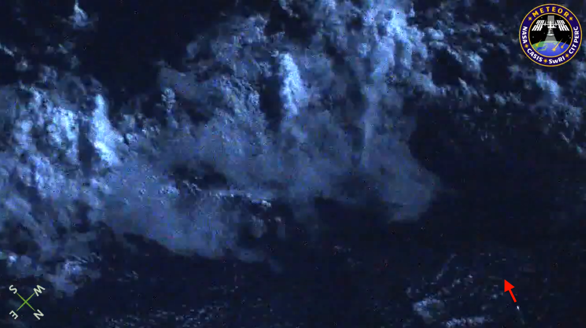
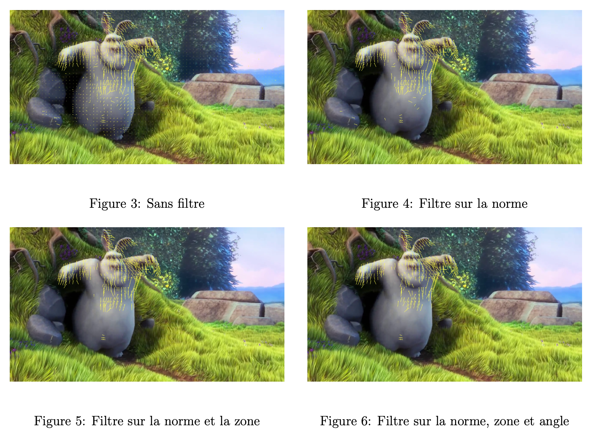

# 2 Algorithme de détection

L’objectif ici est de compresser les images récupérées par le nanosatellite afin d’obtenir les mouvements dans l’image et ainsi déterminer s’il y a un météore ou non.

## 2.1 Compression vidéo

L’idée est alors de détourner l’utilisation de la compression inter-image. En effet, la compression vidéo est une technique permettant de réduire la taille des fichiers vidéo tout en conservant une qualité d’image satisfaisante. Elle repose sur l’exploitation des redondances spatiales et temporelles afin de minimiser la quantité de données nécessaires à la reconstruction des images.

Les vidéos compressées sont généralement constituées de trois types de trames :

- **I-Frames (Intra-coded Frames)** : Trames autonomes qui ne dépendent d’aucune autre image
- **P-Frames (Predicted Frames)** : Trames prédites à partir d’une image précédente, ne stockant que les différences détectées
- **B-Frames (Bidirectionally Predicted Frames)** : Trames prédites en utilisant à la fois des images précédentes et suivantes, permettant une compression plus efficace

Lors de la lecture d’une vidéo, le décodeur reconstruit chaque image en combinant ces différentes trames. Ce procédé est implémenté dans divers codecs tels que H.264, H.265, MPEG-4 Part 2. Ainsi nous allons récupérer et analyser ces vecteurs pour déterminer s’il y a ou non un météore présent sur l’image. De plus, la trajectoire d’un météore est rectiligne ce qui fait qu’il est facilement identifiable si le bruit de la vidéo est faible.

  
*Figure 1 : Représentation d’un météore*

Sur l’image ci dessus, nous pouvons voir un météore sur la droite, se déplaçant vers le bas. Dans cette vidéo le météore est assez simple à détecter du fait du fond noir de la vidéo et la présence du météore sur de nombreuses images successives.

En pratique nous pourrions être confrontés à plusieurs problèmes, d’une part le météore pourrait n’apparaître que dans une seule image s’il se déplace trop rapidement (la caméra sur le nanosatellite filmera en 25 frames/s). D’autre part, le fond de la vidéo serait trop bruité, par des nuages, éclairs ou étoiles ce qui engendrerait une compression difficile à analyser.

Par exemple, en pratique sur l’image suivante, les nuages rendent la détection du météore compliquée en ajoutant du bruit.

  
*Figure 2 : Représentation d’un météore*

## 2.2 Filtrage des vecteurs

### 2.2.1 Motion Vector Extractor

Pour récupérer les vecteurs nous allons utiliser l’outil **Motion Vector Extractor**. Cet outil extrait les images, les vecteurs de mouvement, le type des images des vidéos encodées en H.264 ou MPEG-4. Pour chaque image, on obtient donc :

- L’image décodée au format RGB
- Les vecteurs de mouvement
- Le type de l’image : I, P ou B

De plus, une API est disponible et bien documentée en Python ainsi qu’une en C++. Pour faire la compression, le logiciel FFMPEG est utilisé en arrière-plan. Par la suite nous utiliserons FFMPEG pour décoder des vidéos, compresser des images en jouant sur les paramètres de compression ou encore conserver uniquement une partie d’une vidéo en temps et espace.

### 2.2.2 Application de filtres

Dans cette partie nous allons montrer les résultats obtenus avec l’API Python.

Le programme initial de mv-extractor nous fournit déjà une détection de mouvements. Cependant celui-ci ne filtre aucun vecteur, il nous est donc difficile d’identifier le météore.

Nous cherchons à trouver une solution pour conserver uniquement les vecteurs intéressants, c’est à dire ceux qui décrivent le mouvement du météore.

Nous pouvons conserver les vecteurs avec une norme assez importante pour éliminer le bruit et garder l’essentiel du mouvement. Pour cela on suppose que la norme des vecteurs décrivant le météore est supérieure à celle du bruit.

L’idée vient du fait que nous avons remarqué que lors de la compression, le météore est généralement décrit par plusieurs vecteurs. Ainsi nous pouvons conserver uniquement les vecteurs qui possèdent des voisins assez proches et en nombre suffisants. Pour cela on peut utiliser le module `NearestNeighbors` de Python qui permet de trouver les voisins les plus proches. Nous conservons le vecteur s’il a un nombre suffisant de voisins dans un cercle de rayon fixé. Ce cercle a pour origine l’extrémité finale du vecteur.

Un troisième filtre pouvant être appliqué est spécifique au météore, en effet comme dit précédemment un météore a un mouvement rectiligne. Ainsi après avoir conservé les zones avec du mouvement on filtre en choisissant celles où les vecteurs ont la même direction.

Nous avons commencé par tester nos filtres sur un extrait du court métrage *Big Buck Bunny* car le mouvement est assez simple à analyser.

  

Nous pouvons remarquer qu’en combinant le filtre sur la norme et la zone cela permet de conserver les parties du lapin en mouvement telles que les bras ou les oreilles. En revanche rajouter le filtre sur les angles des vecteurs n’a pas d’utilité dans ce cas-ci.

Faisons la même chose sur une vidéo de météore.

  

Dès l’application du filtre sur la norme et la zone nous arrivons à isoler le météore. En revanche dans la même vidéo il y a un éclair qui, même en appliquant les 3 filtres, reste visible. Nous pourrions appliquer des filtres plus forts mais nous risquons de ne plus détecter le météore.

  
*Figure 11 : Image de météore*

Par la suite, un algorithme de type *knapsack* pourra être implémenté. L’idée serait de maximiser une zone en faisant la somme des normes des vecteurs vitesse tout en minimisant le nombre de vecteurs utilisés et ainsi obtenir la zone de plus forte densité.

## 2.3 API C++

Notre projet ayant pour objectif d’utiliser le moins d’énergie possible, nous avons choisi de traduire le code Python en C++, ce dernier étant un langage de plus bas niveau et plus performant.

Tout comme le programme Python, nous avons amélioré l’API C++ en implémentant des fonctions permettant de filtrer les vecteurs selon leur norme, leur nombre de voisins, et d’éliminer tous les vecteurs isolés.
Pour réaliser cela, il est nécessaire d’installer préalablement les bibliothèques OpenCV et FFMPEG.

```
sudo apt-get update
sudo apt-get install libavcodec-dev libavformat-dev libavutil-dev libswscale-dev libopencv-dev
```

Nous avons aussi ajouté un Makefile sur mv-extractor pour que la compilation soit automatique.

Pour lancer le programme il suffit d’exécuter la commande :

```
./main -v input.mp4 -m -r 20.0 -n 10 -p 1 -V 1 -d output/
```

Nous avons ajouté une fonction generate_timestamp_folder() qui utilise les fonctionnalités de la bibliothèque <\ctime> afin de générer une chaîne au format "YYYYMMDD_HHMMSS".

Pour la commande d’exécution voici la liste des options disponibles :

• -m : Seuil de magnitude.
• -r : Rayon de proximité.
• -n : Nombre minimum de voisins requis.
• -p : Prévisualisation.
• -v : Mode verbeux.
• -h : Afficher l’aide.

Enfin, nous avons comparé les temps d’exécution des versions Python et C++ en variant la norme minimale des vecteurs à conserver. C’est-à-dire qu’il y aura de plus en plus de vecteurs à supprimer mais moins à imprimer sur l’image.

  

Comme attendu, la version C++ est nettement plus performante que celle en Python. Elle est presque 100 fois plus rapide que la version Python.

## 2.4 Piste d'amélioration

Pour optimiser davantage l´algorithme de d´etection de m´eteores et de filtrer plus efficacement
les mouvements qui ont lieu sur les images, on pourrait envisager le ciblage sur le GPU embarqu´e
qui pourrait acc´el´erer significativement les calculs, notamment pour le traitement des nombreuses
videos, demandant beaucoup d’´energie. On pourrait egalement impl´ementer une fonction pour filtrer
plusieurs images successives qui sont obtenues `a partir d’une sequence vid´eos, ce qui permettrait
d’affiner la detection en ayant une precision bien meilleure sur la trajectoire des meteores et leurs
caracteristiques. Enfin, on pourrait aussi augmenter le nombre de videos test´ees avec des param`etres
vari´es , cela permettrait en particulier d’enrichir la base de donn´ees pour l’analyse fonctionnelle PCA,
am´eliorant le mod`ele. Ces pistes donneraient alors une automatisation plus efficace et precise de la
detection de meteores.
