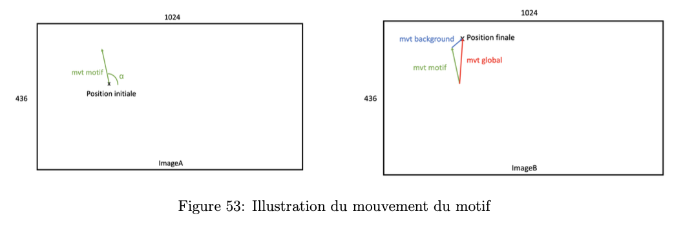
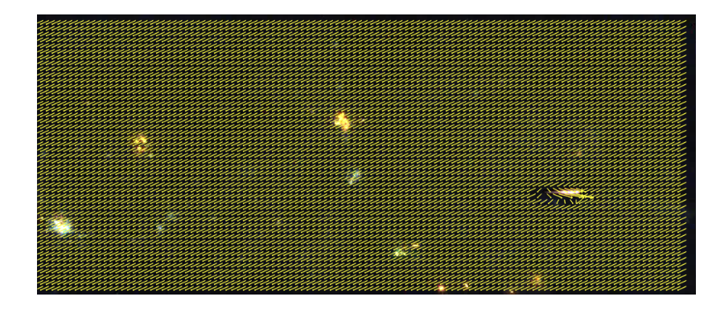

# Génération d'une base de données

## Motivations et idée générale

Comme expliqué plus haut dans "documentation pour FlowNet", FlowNetSimple a été entraîné à partir d'un dataset de synthèse "FlyingChairs". Ce dataset correspond peu à un environnement spatial utile pour notre mission. Les limites de ce dataset sont les suivantes :

- le fond des images utilisées : paysages terrestre (paysage de montagne par exemple) versus paysage spatial
- mouvement des chaises : translations et rotations versus mouvement du météore : rectiligne uniquement
- amplitude du mouvement des chaises différente de l'amplitude du mouvement des météores
- taille des objets : une chaise est bien plus grande qu'un météore

  

Utiliser un autre dataset plus spécialisé (dans la tâche de la mission) sur lequel entrainer le réseau nous a paru naturel. Ce nouveau dataset spécialisé sera, tout comme "FlyingChairs", synthétique et s'appuiera sur une petite base de données de 140 vidéos de météores capturés depuis l'espace.

**Idée générale** : Dans un premier temps, on extrait à partir de la base de données de 140 vidéos 2 types de choses : les paysages spatiaux (qui joueront le rôle de "background" par la suite) et les météores (qui joueront le rôle de motifs à coller par la suite). Une fois que nous avons constitué 2 banques de données avec d'un côté les backgrounds et de l'autre les motifs, on génère des paires d'images aléatoires en collant un motif sur un background. Enfin, on génère le fichier ".flo" associé à chaque paire qui correspond au flot optique entre les 2 images de la paire. Ce dernier fichier jouera le rôle de "Ground Truth" (GT) dans l'apprentissage.

**Remarque** : Pour constituer la banque des motifs, on cherche le moment dans chaque vidéo où le météore est le plus visible, on fait un arrêt sur image et on détoure le météore.

## Génération d'une paire d'images

Pour que le dataset soit le plus réaliste possible on a introduit 2 types de mouvements dans les paires d'images : le mouvement de translation du background (qui traduit le déplacement de la caméra) et le mouvement rectiligne du motif plus ample que la translation du background (correspond au déplacement du météore).

Pour commencer la génération, on choisit aléatoirement : le background parmi une banque de 275 images et le motif parmi une banque de 50 images. L'objectif est donc de créer une paire de 2 images : imageA et imageB à partir du background et du motif choisis.

  

### Translation du background

Afin d'introduire un mouvement de translation pour le fond, le background est de base plus grand que la taille finale de la paire d'images. Cela nous permet d'effectuer une translation.

  

L'imageA se situe toujours au centre du background. L'imageB est l'image recadrée (de même taille que l'imageA) suivant la translation induite par l'angle θ.  
Ici l'angle θ est choisi aléatoirement tout comme l'amplitude de déplacement entre l'imageA et l'imageB (c'est-à-dire la norme du vecteur de déplacement). En pratique, on fait varier l'amplitude de déplacement entre 0 et 2 pixels. Dans 40% des cas l'amplitude vaut 0, pour le reste des cas l'amplitude vaut 2 pixels.

### Mouvement du motif

Après avoir généré un déplacement pour le background, il est nécessaire de coller le motif sur l'imageA et de lui créer un déplacement pour ensuite répercuter celui-ci sur l'imageB. Pour générer des mouvements de météores diversifiés, on procède de la manière suivante :

- on choisit une position initiale aléatoire du météore sur l'imageA (suivant une loi uniforme sur la largeur et la hauteur)
- on choisit une direction de déplacement du météore aléatoire suivant l'angle α (loi uniforme)
- on choisit une amplitude de déplacement aléatoire du météore (loi uniforme) entre 4 et 10 pixels.

**Remarque** : on introduit un padding pour la position initiale afin d'éviter que le météore soit sur le bord de l'image.

  

Finalement, pour obtenir l'imageA on colle le motif à la position initiale. Pour obtenir l'imageB, on colle le motif à la position initiale + le déplacement du motif en tenant compte du déplacement du background (déterminé précédemment).

  

### Génération du flot optique associé

Après avoir entièrement déterminé le mouvement du background ainsi que celui du motif, on peut facilement calculer le flot optique associé à la paire d'images car on connaît le déplacement de chaque pixel.

  

Dans cet exemple, θ vaut environ 270° tandis que α vaut environ 0°.