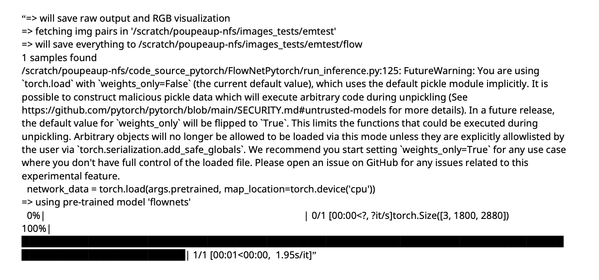

# FlowNet sur em780 (Python 3.12.3)

## Installation du projet et des librairies

Copie du projet FlowNet :  
- Copie du code dans le répertoire « FlowNetPytorch » :  
  Cloner le projet depuis  
  https://github.com/paul-pp/flownet  
- Copie du modèle pré-entrainé dans le répertoire « trained_model » :  
  Télécharger un des fichiers (depuis le répertoire Pytorch).pth avec ce lien  
  https://drive.google.com/drive/folders/16eo3p9dO_vmssxRoZCmWkTpNjKRzJzn5  

Créer un répertoire « erntest » :  

Dans ce répertoire, il faut copier des paires d’images. Pour cela, il faut que les 2 images d’une paire proviennent d’une même vidéo (séparées d’un petit intervalle de temps) et soient de même dimension. Celles-ci doivent être nommées de la manière suivante :  
`<nom_de_la_paireA>1.<extension>`, `<nom_de_la_paireA>2.<extension>`, `<nom_de_la_paireB>1.<extension>`, `<nom_de_la_paireB>2.<extension>`,...  

Copie du projet sur le front : (en local)  
- Copie du code :  
  `scp -r FlowNetPytorch front.mono.lip6.ext:~/`  
- Copie d’un modèle pré-entrainé :  
  `scp -r trained_model front.mono.lip6.ext:~/`  
- Copie des images dont on cherche le flux optique :  
  `scp -r erntest front.mono.lip6.ext:~/`  

Connexion à la machine em780 : (en local)  
`ssh em780.mono.lip6.ext`  

Déplacement du projet sur scratch : (depuis `/nfs/users/<username>-nfs`)  
`mv FlowNetPytorch /scratch/<username>-nfs/code_source_pytorch/`  
`mv trained_model/ /scratch/<username>-nfs/code_source_pytorch/` 
`mv emtest /scratch/<username>-nfs/images_tests/`

Création d’un environnement python et activation: (depuis/scratch/<\username>-nfs/code_source_pytorch)
- Création :
`python3 -m venv venv-flownet`
- Activation :
`source venv-flownet/bin/activate`

Installation des librairies nécessaires dans l’environnement : (depuis/scratch/<\username>-nfs/code_source_pytorch et lorsque «venv-flownet» estactivé)
`pip3 install -r FlowNetPytorch/requirements.txt`

Visualisation des versions des librairies avec « pip3 list »:

  

  

Désactiver l’environnement virtuel :
`$deactivate`

## Mise en forme des images

Pour extraire des images et les modifier, nous avons utilisé des commandes ffmpeg. Nous avons aussi essayé d’automatiser les tests sans succès : nous devions repérer le météore à l’oeil nu pour pouvoir récupérer les frames intéressantes et crop les images au bon endroit.

Voici les commandes ffmpeg utilisées qui pourraient être intéressantes dans le cadre de ce projet :

- Pour créer une vidéo :  
  `ffmpeg -r 5 -i Path/to/img/flow%02d.png -vcodec libx264 -crf 25 output.mp4`  
  - `-r 5` : le fps (5 frames par seconde)  
  - `-i Path/to/img/flow%02d.png` : les images. ffmpeg a besoin d’une image de « début » entre 0 et 4. Ici le format est toutes les images entre `flow00.png` à `flow99.png`.  
  - `-vcodec libx264` : le codec vidéo utilisé.  
  - `-crf 25` : la qualité de la vidéo. Pour x264, les valeurs raisonnables sont entre 18 et 28.  
  - `output.mp4` : le nom du fichier de sortie.  

- Pour redimensionner une vidéo :  
  `ffmpeg -i input.mp4 -vf scale=1920:1080 output.mp4`  
  (ici en 1920x1080)  

- Pour crop une image :  
  `ffmpeg -i input.mp4 -vf "crop=448:320:0:0" output.mp4`  
  - `448:320` : dimensions du crop (abscisse puis ordonnée).  
  - `0:0` : emplacement du coin du crop en haut à gauche (ici le crop sera fait le plus en haut à gauche possible ; abscisse puis ordonnée).  
  Cette commande fonctionne aussi avec des images.  

- Pour récupérer des informations sur une vidéo :  
  `ffmpeg -i input.mp4`  

- Pour transformer une vidéo de couleur à en nuance de gris :  
  `ffmpeg -i input.mp4 -vf hue=s=0 output.mp4`  

- Pour récupérer des images d’une vidéo :  
  `ffmpeg -i input.mp4 -s start -t end <dossier>/frame%03d.png`  

Aussi, nous avons écrit des scripts python pour dupliquer et renommer les images correctement pour pouvoir les tester, disponibles dans le dossier :  
`/scratch/<username>-nfs/code_source_pytorch/FlowNetPytorch`.  
Il serait aussi possible de changer directement le code de FlowNet pour adapter l’entrée. Pour les utiliser, nous avons besoin de la librairie `os`, `sys` et `shutil` de python.  

Le `renameforflownet.py` permet de dupliquer et changer le nom des images de « `frame%03d.png` » à « `paire%03d_1.png` » et « `paire%03d_2.png` » (avec des conditions aux bords).  
Commande :  
`python renameforflownet.py Path/to/img start end`  
- `Path/to/img` : le dossier où sont les images.  
- `start` : la première frame (le nombre) dont on veut calculer le flot optique.  
- `end` : la dernière frame dont on veut calculer le flot optique.  

Le `renamefromflower.py` permet de modifier le nom des images en sorties pour pouvoir créer une vidéo avec la commande ffmpeg nécessaire.  
Commande :  
`python renamefromflower.py Path/to/img start end`  
- `Path/to/img` : le dossier où sont les images.  
- `start` : la première frame (le nombre) dont on a calculé le flot optique.  
- `end` : la dernière frame dont on a calculé le flot optique.  

## Lancement de l’inférence

Activer l’environnement « venv-flownet » : (depuis `/scratch/<username>-nfs/code_source_pytorch`)  
`source venv-flownet/bin/activate`  

Lancer l’inférence : (depuis `/scratch/<username>-nfs/code_source_pytorch`)  
`python3 FlowNetPytorch/run_inference.py /scratch/<username>-nfs/images_tests/emtest trained_model/flownets_EPE1.951.pth`  

Remarques :  

- Le 1er chemin correspond au script python permettant l’inférence du modèle pré-entrainé situé au 3ᵉ chemin. Les images en entrée sont situées dans le 2ᵉ chemin.  
- Si vous tentez de lancer la commande précédente dans un répertoire qui ne vous appartient pas, il est probable que vous ayez une erreur (de droit d’écriture dans le dossier d’un utilisateur externe) car le programme doit enregistrer l’image de flux optique dans le dossier « entest » qui appartient à l’utilisateur ayant le code source. Pour éviter cela, il faudrait que vous copiez le dossier entest dans votre répertoire avec la paire d’images à tester. Et vous pourrez relancer la commande suivante :  
  `python3 FlowNetPytorch/run_inference.py /scratch/<votre_username>-nfs/images_tests/entest trained_model/flownets_EPE1.951.pth`  

- L’option `-g` (`--gpu`) (et respectivement `-c` (`--cpu`)) permet de forcer le lancement de FlowNet sur le GPU (respectivement sur le CPU). Par défaut, si le GPU existe, l’inférence sera lancée sur GPU. Un exemple de commande pour lancer sur CPU uniquement pourrait être :  
  `python3 FlowNetPytorch/run_inference.py /scratch/<username>-nfs/images_tests/entest trained_model/flownets_EPE1.951.pth -c`  

- L’option `-v` (`--output-value`) permet de spécifier le type de sortie pour le flot optique désiré. Il y a 2 types de sorties possibles :  
  - Le type « raw » est un fichier de sortie de type « .npy » qui correspond à un tableau stockant le flot optique (de 2 frames successives).  
  - Le type « viz » est une image (de format png par exemple) qui correspond à la représentation en couleur du flot optique entre 2 frames successives.  
  Enfin, si vous spécifiez « both », le programme génère automatiquement les types « raw » et « viz » simultanément (option par défaut). Voici un exemple de commande pour générer que des visualisations en couleur du flot optique :  
  `python3 FlowNetPytorch/run_inference.py /scratch/<username>-nfs/images_tests/entest trained_model/flownets_EPE1.951.pth -v viz`  

- Si plusieurs paires d’images sont présentes dans le dossier entest, `run_inference.py` les traitera toutes.  

On obtient la sortie suivante pour cpu :

  

On obtient la sortie suivante pour gpu :

  

Remarque : run_inferencecpu.py diffère que d’une seule ligne par rapport à run_inferencegpu.py (voir ligne 122 environ, variable network_data)

Désactiver l’environnement « venv-flownet» : (depuis /scratch/<\username>-nfs/code_source_pytorch)
`$deactivate`

Récupérer l’/les image/s de flot optique générée/s :
- depuis /scratch/<\username>-nfs :
`cp images_tests/emtest/flow/imagetest_flow.png /nfs/users/<\username>-nfs/`
- en local :
`scp front.mono.lip6.ext:~/imagetest_flow.png /Users/<le-chemin-en-local>`

## Visualisation du flot optique grâce à des vecteurs

Une fois l’inférence lancée sur des paires d’images, il peut être intéressant de visualiser le flot optique à l’aide de vecteurs. Pour cela, il y a le fichier `visu_vector.py` dans le dossier `/scratch/<username>-nfs/code_source_pytorch/FlowNetPytorch`. On peut lancer la commande suivante sur le dossier « emtest » (depuis `/scratch/<username>-nfs/code_source_pytorch`) :  

`python3 FlowNetPytorch/visu_vector.py -f /scratch/<username>-nfs/images_tests/emtest -b 145 -e 178 --arrow_size 1 --arrow_segmentation 2`  

Remarques :  

- Attention, cela implique d’avoir lancé `run_inference.py` avant en mode « raw » sur le dossier emtest.  
- Il est nécessaire que les paires d’images du dossier « emtest » soient nommées de la manière suivante avant l’inférence : `paire1_1.png`, `paire1_2.png`, `paire2_1.png`, `paire2_2.png`, `paire3_1.png`, etc.  
- Si aucune flèche jaune n’apparaît sur les images en sortie, il faut augmenter `--arrow_size`.  
- L’option obligatoire `-f` (`--folder`) permet de spécifier le chemin du dossier contenant les paires d’images qui ont été traitées par l’inférence en mode « viz ».  
- L’option `-b` (`--begin_frame`) (respectivement `-e` (`--end_frame`)) permet de spécifier la première paire d’images à traiter (resp. la dernière).  
- L’option `--arrow_size` permet de régler la taille des flèches sur les images en sorties (prend des valeurs décimales).  
- L’option `--arrow_segmentation` (prend que des entiers) permet de régler l’espacement entre chaque flèche. Plus la valeur est grande, plus les flèches seront espacées (moins il y en aura dans l’image).  

## Entrainement à partir de l’architecture « mpi_sintel_clean »

L’entrainement sert à créer son propre modèle avec ses propres poids à partir d’un jeu de données d’entrainement. Ce modèle sera ensuite utilisé de la même manière que « flownets_EPE1.951.pth » qu’on retrouve dans les paramètres de « run_inference.py ».  

Pour effectuer l’entrainement, on supposera que le jeu de données utilisé respecte l’arborescence du dataset « mpi_sintel_clean », c’est-à-dire que le dataset soit de la forme :  

  

On peut ainsi lancer l’entrainement sur le dataset « dataset_syn » de la manière suivante :  

`python3 /scratch/<username>-nfs/code_source_pytorch/FlowNetPytorch/main.py /scratch/<username>-nfs/gen_dataset/dataset_syn -b8 -j8 -a flownets --dataset mpi_sintel_clean --epochs 60 --split-value 0.95`  

- `"/scratch/<username>-nfs/gen_dataset/dataset_syn"` est le chemin du dataset utilisé.  
- `-b8` indique que le nombre de paires d’images utilisées pour un batch (1 batch ≈ 1 unité d’apprentissage) est de 8.  
- `-j8` indique que le nombre de « travailleurs » (lors de la présence de GPU) est de 8 (utile pour paralléliser l’apprentissage).  
- `-a flownets` indique qu’on utilise FlowNetSimple pour l’apprentissage (et pas FlowNetCorr ou d’autres architectures par exemple).  
- `--dataset mpi_sintel_clean` indique qu’on utilise un dataset utilisant la même arborescence que « mpi_sintel_clean ».  
- `--epochs 60` initialise le nombre d’epochs à 60. L’apprentissage sera donc effectué 60 fois de suite sur le même dataset.  