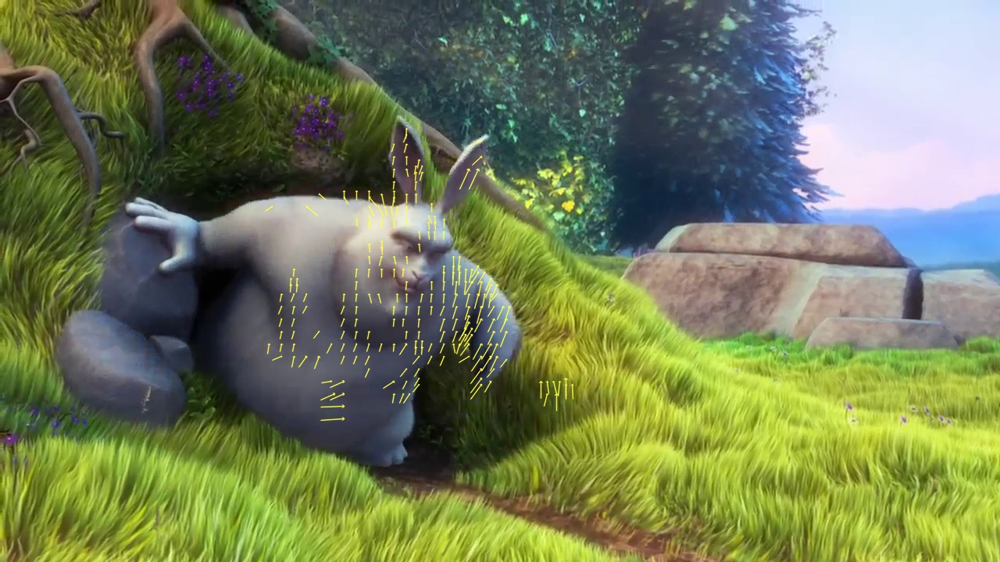
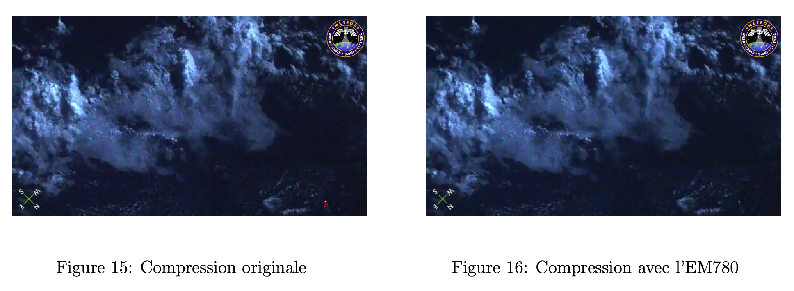

# Motion Vector Extractor

L’étape suivante consiste à décomposer la vidéo en frames et récupérer ceux avec seulement l’apparition d’un météore tout en réduisant le nombre de pixels de cette même frame. Il s’agit d’un programme de traitement d’image où des filtres vont être appliqués aux pixels des images obtenues à partir de la décomposition de la vidéo, permettant ainsi d’obtenir en sortie seulement un nombre de pixel limité avec la zone de mouvement, ce qui augmentera la qualité des images obtenues.

Nous utiliserons **Motion Vector Extractor** de Lukas Bommes, un outil utilisant Python et C++ qui extrait les vecteurs de mouvement de vidéos encodées dans des formats H.264 ou H.265. Ces vecteurs indiquent les déplacements d’objets entre les images successives, utiles pour l’analyse de mouvement. Cet outil facilite ainsi l’exploitation directe des informations de mouvement pour divers traitements d’image et applications d’apprentissage automatique.

### Application de filtres

Le programme initial nous fournit déjà une détection de mouvements. Cependant, celui-ci n’est pas assez précis avec des vecteurs qui apparaissent dans des zones où le mouvement est invisible. Nous cherchons à trouver une solution pour supprimer les vecteurs ressemblant à des points et ainsi conserver uniquement les vecteurs "intéressants".

La première idée serait de conserver les vecteurs avec une norme suffisamment importante. En choisissant une norme arbitrairement, le résultat était correct mais peu judicieux car la norme devait être choisie manuellement.

Une autre idée était de conserver uniquement les vecteurs qui possèdent des voisins assez proches et en nombre suffisants. Pour cela, on peut utiliser le module 'NearestNeighbors' de Python qui permet de trouver les voisins les plus proches. Ainsi, nous pouvons appliquer un filtre en conservant uniquement les vecteurs ayant un nombre minimum de voisins proches. Les résultats obtenus en filtrant uniquement sur la zone ne sont pas bons, on a alors combiné les deux idées avec le filtre sur la norme et la zone. Nous obtenons ainsi un bon suivi des zones en mouvement avec l’apparition de vecteurs.

  
*Avant*

  
*Après*

### Capture de zones d’intérêts

Nous appliquons ensuite ces filtres aux extraits de météores, ce qui nous fournit un résultat satisfaisant avec des vecteurs apparaissant seulement lorsqu’un météore est visible dans l’image.

  
*Avant*

  
*Après*