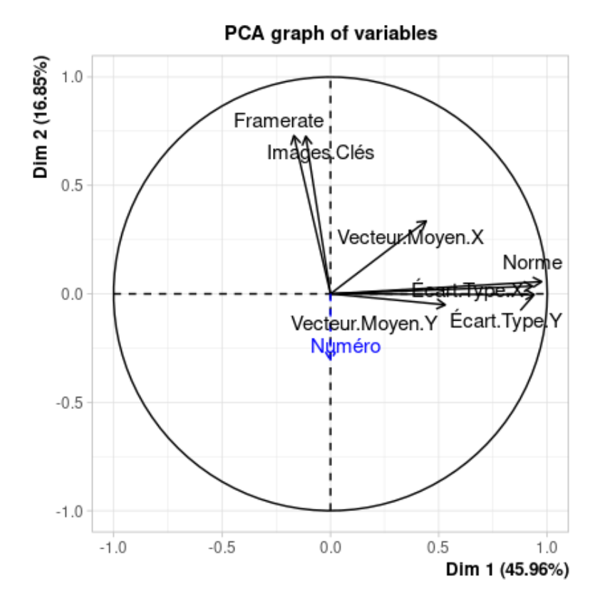
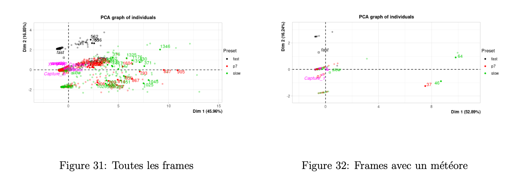
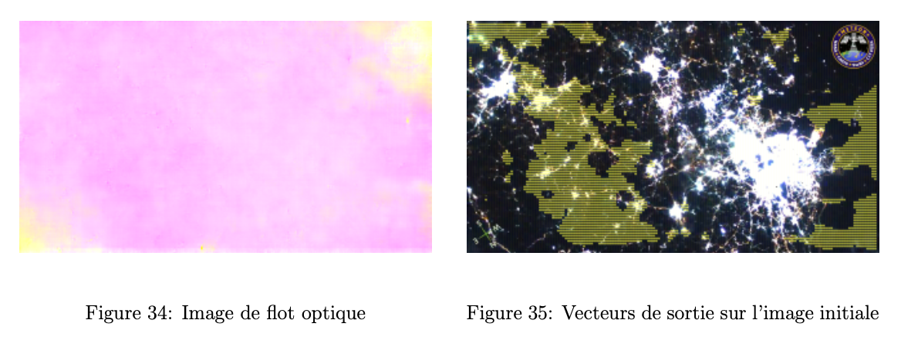
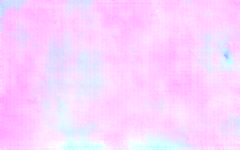
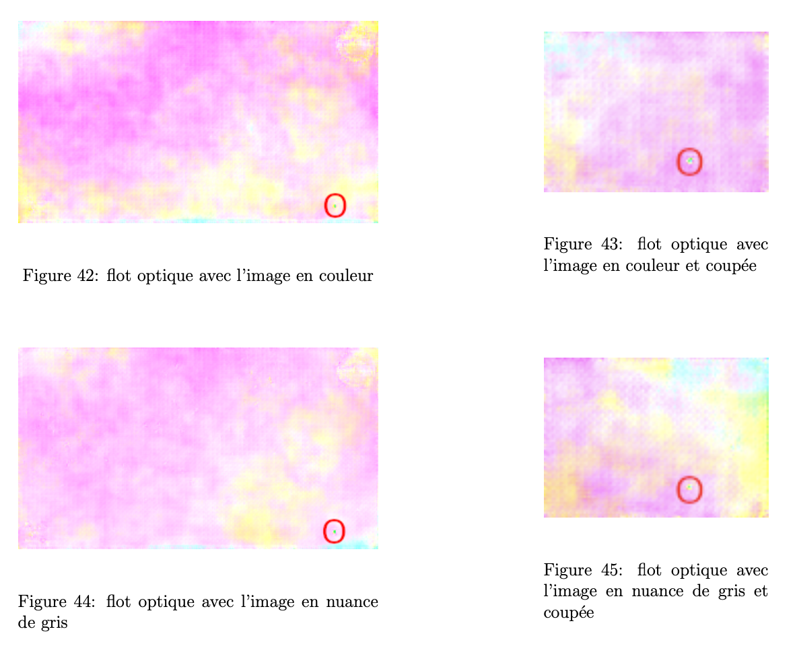
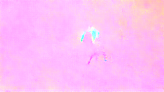

# Résultats FlowNet

Dans cette section, on présente quelques résultats de l’inférence de FlowNet à partir de 2 modèles pré-entraînés.

### 1er modèle : FlowNetS (EPE à 1.951)

  
*Mouvement d’entrée*

  
*Flow obtenu*

  
*Mouvement d’entrée*

  
*Flow obtenu*

### 2e modèle : FlowNetS (entraîné par les créateurs de FlowNet)

  
*Mouvement d’entrée*

  
*Flow obtenu*

  
*Mouvement d’entrée*

  
*Flow obtenu*

On en conclut que le 2e modèle donne à priori des résultats plus satisfaisants que le premier.

### Résultats plus précis à partir du 2e modèle

Pour ce dernier test, les images extraites de la vidéo sont prises avec le paramètre 10 fps, ce qui correspond à un delta temps plus élevé que pour les météores. En effet, on a choisi d’augmenter le delta car la vidéo initiale est une vidéo au ralenti, donc les mouvements sont bien plus lents que pour les météores.

  
*Entrée : 20 fps (delta temps de 5.10⁻³ sec entre 2 frames), résolution de 3840x2160*

  
*Flow obtenu*

  
*Entrée : 20 fps, résolution de 1280x720*

  
*Flow obtenu*

  
*Figure 21: Entrée : 10 fps (delta temps de 10.10⁻³ sec entre 2 frames), résolution de 1280x720*

  
*Figure 22: Flow obtenu*

### Analyse critique des résultats

Les images de flux optique obtenues précédemment représentent, pour certaines, un flux optique assez satisfaisant et pertinent par rapport au mouvement étudié. C’est le cas pour les figures 14, 16 et 18. Néanmoins, pour les autres images, certains flux optiques demeurent insatisfaisants. En effet, dans l’image du flux optique, on ne peut ni distinguer nettement à l’œil nu le mouvement étudié (Figure 12) ni le caractériser (Figure 20). On a vu que cette performance pouvait être fortement liée au choix du modèle entraîné mais aussi au choix de différents paramètres sur la paire d’image à l’entrée : fps (delta temps entre les 2 images) (voir la différence entre la figure 14 et 22 pour laquelle le delta temps est plus petit), la résolution des images et le recadrage sur le mouvement étudié. Étant donné que nous ne sommes pas encore capables de détecter nettement le météore de la figure 19, nous devons poursuivre notre recherche pour augmenter la performance du modèle sur tous les types de météores. Pour cela, nous allons continuer de jouer sur les différents paramètres évoqués, éventuellement tenter d’entraîner (ou de "fine-tuner") le réseau avec un dataset spécifique aux météores et tester FlowNet2 durant le 2e semestre.